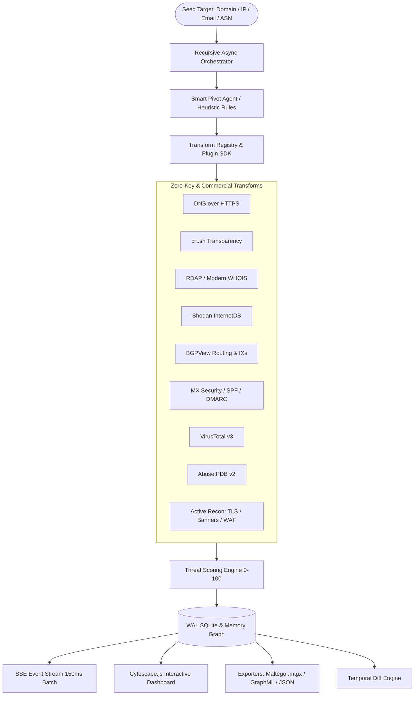

# Heimdall OSINT Engine 🛡️
> **Next-Generation Modular OSINT Link-Analysis Transform & Ingestion Engine**  
> *A high-performance, asynchronous, open-source alternative to commercial platforms like Maltego.*


[](https://python.org)
[](https://fastapi.tiangolo.com)
[](https://js.cytoscape.org/)
[]()
[]()

---

## 🌟 Overview

**Heimdall** is an advanced link-analysis and attack-surface intelligence engine designed for security researchers, red teams, penetration testers, and threat intelligence analysts. It transforms raw target inputs (domains, IPs, emails, ASNs) into canonical knowledge graphs, recursively mapping out infrastructure, discovering exposed services, quantifying risk via a multi-factor threat scoring engine, and providing an interactive visual workbench.



---

## 🚀 Key Highlights & Capabilities

### 1. 🖥️ Interactive Maltego-Style Web UI (`/ui`)
- **Cytoscape.js + `fcose` physics layout**: Non-jittering, stable graph animation designed for real-time incremental node additions.
- **150ms SSE Event Batching**: Eliminates UI thrashing during recursive deep crawls by batching event streams.
- **Entity Type Color System**: 16 distinct canonical entity colors, shapes, and badges.
- **A* Shortest Pathfinder**: Click source and target to compute the shortest attack chain highlighted in high-contrast gold.
- **Ego-Net Radius Filter**: 1-to-5 hop neighborhood slider to isolate subgraphs and dim peripheral noise.
- **Compound Node Grouping**: One-click clustering of sprawling graphs into parent containers by entity type.
- **Temporal Diffing Visualizer**: Visual comparison highlighting newly discovered nodes (neon green), removed assets (dashed red), and modified threat scores.

### 2. 🔌 Community Transform Plugin SDK (`@heimdall_plugin`)
Transform authors can write custom transforms with a single async Python function:
```python
from heimdall.transforms.sdk import heimdall_plugin
from heimdall.core.models import EntityType, GraphEdge

@heimdall_plugin(
    name="custom_osint_pivot",
    input_types=[EntityType.Domain],
    output_types=[EntityType.IPv4],
    description="Custom OSINT lookup"
)
async def custom_osint_pivot(entity_urn: str, properties: dict) -> list[GraphEdge]:
    ...
```
- Includes **dynamic class synthesis** into `BaseTransform` and **zero-downtime hot reloading** via `/api/v1/plugins/reload`.

### 3. 🧠 Smart Pivot Agent & Noise Suppression
- Evaluates discovered node properties against heuristic rules (`config/pivot_rules.yaml`) to dynamically rank the transform frontier.
- **CDN & Cloud IP Suppression**: Identifies Cloudflare, Akamai, Fastly, CloudFront, and Google Cloud edge IPs to prevent wasting transforms on shared proxies.
- **Generic OpenAI-Compatible LLM Fallback**: Seamlessly supports OpenAI, Gemini, or local Ollama instances for AI-guided pivots with strict fallback to deterministic heuristics.

### 4. ⚖️ Weighted Threat Scoring Engine
Calculates continuous risk scores (0–100) and tiers (Low, Medium, High, Critical):
$$\text{ThreatScore} = \min(100, 0.35 \times \text{AbuseIPDB} + 0.30 \times \min(100, \text{VT\_Ratio} \times 200) + 0.25 \times \text{CVE\_Sum} + 0.10 \times \text{Port\_Risk})$$

### 5. 🛡️ Safe Active Reconnaissance (Opt-In)
Safely gated behind `ACTIVE_RECON=true` with configurable rate limits:
- **`tls_cert_extract`**: Direct TLS handshake to extract subject, issuer, and Subject Alternative Names (SANs).
- **`banner_grab`**: Captures raw service banners across HTTP, SSH, SMTP, FTP, etc.
- **`http_security_audit`**: Audits CSP, HSTS, X-Frame-Options headers and detects WAF signatures (Cloudflare, AWS WAF, Imperva, etc.).

### 6. 🕒 Automated Scheduled Sweeps & Temporal Diffing
- Built-in SQLite-backed cron scheduler daemon supporting 5-field cron syntax (`*/15 * * * *`).
- Automatically compares periodic sweeps against previous investigation snapshots, surfacing asset drift and delta metrics.

---

## 📦 Transform Catalog

| Transform | Input Type | Output Types | Zero-Key? | Source |
|---|---|---|:---:|---|
| `dns_resolution` | Domain, Subdomain | IPv4, IPv6, Domain, Subdomain | ✅ Yes | Cloudflare DoH |
| `crtsh_subdomains` | Domain | Subdomain | ✅ Yes | crt.sh CT Logs |
| `whois_rdap` | Domain, IPv4 | Registrar, Org, Email | ✅ Yes | ICANN / ARIN RDAP |
| `shodan_internetdb` | IPv4 | PortService, CVE, CPE | ✅ Yes | Shodan InternetDB |
| `bgp_routing` | ASNumber, IPv4 | CIDRBlock, ASNumber, IX | ✅ Yes | BGPView.io |
| `mx_security` | Domain | MXServer, SPFRecord, DMARCPolicy | ✅ Yes | Cloudflare DoH |
| `reverse_whois` | Email, Org | Domain | ✅ Yes | HackerTarget |
| `web_surface` | Domain | PortService, Email | ✅ Yes | Direct HTTP |
| `virustotal_reputation` | Domain, IPv4 | MaliciousDetection, ThreatScore | ❌ Key | VirusTotal API v3 |
| `abuseipdb_check` | IPv4 | AbuseReport, ThreatScore, Org | ❌ Key | AbuseIPDB API v2 |
| `shodan_host_enrichment` | IPv4 | PortService, CVE, Banner | ❌ Key | Shodan REST API |
| `tls_cert_extract` | Domain, IPv4 | TLSCertificate, Subdomain | 🔒 Active | Direct TLS Socket |
| `banner_grab` | IPv4 | ServiceBanner | 🔒 Active | Direct TCP Socket |
| `http_security_audit` | Domain, IPv4 | SecurityHeader, WAFSignature | 🔒 Active | Direct HTTP |

*Key-required transforms return a non-blocking `SKIPPED` status when keys are omitted, ensuring uninterrupted crawls.*

---

## ⚡ Quick Start

### 1. Clone & Setup Virtual Environment

```bash
git clone https://github.com/avikengineer007/Heimdall---OSINT-Link-Analysis-Transform-Ingestion-Engine.git
cd Heimdall---OSINT-Link-Analysis-Transform-Ingestion-Engine

python -m venv .venv
# On Windows:
.venv\Scripts\activate
# On Linux/macOS:
# source .venv/bin/activate

pip install -r requirements.txt
```

### 2. Configure Environment

Copy `.env.example` to `.env`:
```bash
cp .env.example .env
```
Fill in any optional API keys you have (VirusTotal, AbuseIPDB). Zero-key transforms run immediately without configuration.

### 3. Launch Server & UI

```bash
uvicorn heimdall.api.app:app --reload --port 8000
```
- **Web Dashboard**: [http://localhost:8000/ui](http://localhost:8000/ui)
- **Interactive API Docs**: [http://localhost:8000/docs](http://localhost:8000/docs)

---

## 💻 Command Line Interface (CLI)

#### Discover Available Transforms
```bash
python -m heimdall.cli transforms list
```

#### Run a Single Transform
```bash
python -m heimdall.cli transforms run bgp_routing --input ASNumber:13335
```

#### Launch Recursive Investigation
```bash
# 2 hops deep with JSON and Maltego .mtgx export
python -m heimdall.cli investigate --seed tesla.com --depth 2 --export graph.json
```

---

## 🐳 Docker Deployment

To run Heimdall with Neo4j and Nginx:
```bash
docker-compose up --build -d
```
- **Web Dashboard**: `http://localhost:8000/ui` (or `http://localhost` if proxy enabled)
- **Neo4j Browser**: `http://localhost:7474` (User: `neo4j` / Password: `heimdall_secret_graph`)

---

## 🧪 Testing

Heimdall includes a comprehensive test suite with 69 passing tests covering unit logic, transforms, sanitizers, diffing, smart agent heuristics, and API endpoints:

```bash
pytest tests/ -v
```

```text
============================= 69 passed in 21.93s =============================
```

---

## 📄 License

Distributed under the MIT License. See `LICENSE` for more information.

