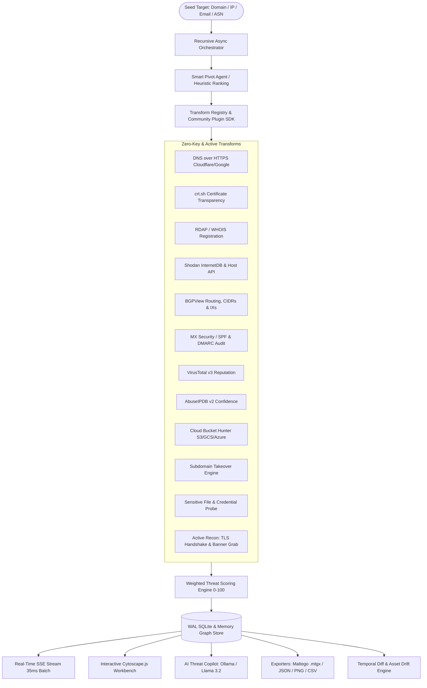

# Heimdall OSINT Engine 🛡️
> **Autonomous Link-Analysis Transform & Threat Ingestion Engine**  
> *A high-performance, asynchronous, open-source alternative to commercial platforms like Maltego.*

[](https://github.com/avikengineer007)
[](https://python.org)
[](https://fastapi.tiangolo.com)
[](https://js.cytoscape.org/)
[]()
[]()

---

## 👨‍💻 Inventor & Lead Architect

**Heimdall** was invented, designed, and architected by **[Avik Ghosh](https://github.com/avikengineer007)**.

Created as a modern, sovereign, and fully extensible counter-response to closed-source commercial intelligence platforms like Maltego, Paterva, and SpiderFoot, Heimdall unifies zero-key OSINT transforms, active reconnaissance, automated attack path graph analytics, and AI-assisted threat briefings into a single unified platform.

---

## 🌟 What is Heimdall?

**Heimdall** is an enterprise-grade external attack surface management (EASM) and cyber threat intelligence (CTI) engine. Starting from a single seed indicator (a root domain, IP address, CIDR block, email address, or Autonomous System Number), Heimdall:

1. **Recursively Harvests Infrastructure**: Resolves forward/reverse DNS over HTTPS, certificate transparency logs, BGP routing tables, cloud storage buckets, and open network services.
2. **Detects High-Impact Vulnerabilities**: Automatically spots dangling DNS records vulnerable to **Subdomain Takeovers**, exposed configuration leaks (`.env`, `.git`, `docker-compose.yml`), exposed cloud storage buckets (AWS S3, Azure Blob, GCS), and mail spoofing flaws (missing SPF/DMARC).
3. **Quantifies Real Risk**: Computes a continuous 0–100 weighted **Threat Score** synthesizing CVE exposures, open ports, IP reputation, and malware telemetry.
4. **Calculates Exploitable Attack Paths**: Identifies weakest links and shortest paths traversing from external perimeter assets directly to internal services using graph pathfinding ($A^*$).
5. **Generates CISO Executive Briefings**: Features an **AI Threat Copilot** that works 100% locally with private LLMs via **Ollama** or cloud APIs, producing natural language graph querying and instant board-ready executive threat reports.



---

## 🎯 Real-Life Use Cases & Operational Playbooks

Heimdall is designed from the ground up to solve critical security operations in enterprise and red-team environments:

### 1. ⚔️ Red Teaming & External Attack Surface Management (EASM)
* **The Scenario**: You are conducting an authorized external penetration test or bug bounty assessment on a target company (e.g., `example.com`).
* **How Heimdall Solves It**:
  1. Input `example.com` at **Depth 2**.
  2. Heimdall recursively expands hundreds of subdomains via Certificate Transparency and DNS over HTTPS.
  3. The **Subdomain Takeover Transform** flags dangling CNAMEs pointing to unclaimed GitHub Pages, Amazon S3, Heroku, or Azure buckets (`TAKEOVER_VULNERABILITY` node highlighted in bright red).
  4. The **Exposure Probe** simultaneously queries web roots for inadvertently exposed `.env`, `.git/HEAD`, or `docker-compose.yml` configuration leaks.
  5. The **Cloud Bucket Hunter** identifies company branded S3/Azure/GCS buckets that are public or listing-enabled.

### 2. 🕵️ Threat Intelligence & DFIR (Incident Response)
* **The Scenario**: Security Operations (SOC) flags a suspicious C2 IP address or phishing domain attempting beaconing inside the corporate network.
* **How Heimdall Solves It**:
  1. Input the malicious indicator into Heimdall.
  2. Run `bgp_routing` and `shodan_internetdb` to identify the hosting provider, ASN, co-located services, and active listener ports.
  3. Use `reverse_whois` and TLS certificate analysis to pivot from registrant emails or SSL serial numbers to find secondary staging infrastructure operated by the same threat actor.
  4. The **Attack Path Analyzer** computes the graph relationship chain connecting the attacker's infrastructure to known corporate assets.

### 3. 🏢 Corporate Due Diligence & Supply Chain Auditing
* **The Scenario**: Prior to a merger, acquisition, or third-party vendor onboarding, you need an unbiased assessment of their cyber hygiene.
* **How Heimdall Solves It**:
  1. Enter the target organization's primary domain.
  2. Inspect the **Threat Scorer Distribution** (0–100 score).
  3. Review the automated **CISO Threat Intelligence Briefing** to identify open administrative services (RDP, SSH, Telnet, exposed database ports), mail security rating (SPF/DMARC posture), and vulnerable legacy systems.
  4. Export an official **Executive PDF/HTML Report** for executive leadership and compliance officers.

### 4. 🤖 Air-Gapped AI Threat Hunting (Local Ollama LLM)
* **The Scenario**: Strict privacy regulations forbid sending internal IP ranges or vulnerability telemetry to public cloud AI APIs (like OpenAI or Google).
* **How Heimdall Solves It**:
  1. Heimdall natively connects to a local **Ollama** instance (`http://localhost:11434/v1`) running on your machine (e.g. `llama3.2` or `mistral`).
  2. Open the **Threat Copilot** drawer (`🤖`) in the UI.
  3. Query the graph in plain English:
     * *"Show me all critical high-risk assets."*
     * *"Are there any dangling DNS takeovers?"*
     * *"List exposed databases and cloud buckets."*
  4. The local LLM parses graph intent and filters the canvas with zero external data leakage.

### 5. 🕒 Continuous Monitoring & Asset Drift (Temporal Diffing)
* **The Scenario**: Infrastructure teams spin up temporary cloud dev clusters that developers forget to decommission.
* **How Heimdall Solves It**:
  1. Configure scheduled scans via Heimdall's built-in background scheduler.
  2. As new assets appear over time, Heimdall's **Temporal Diff Engine** compares the latest graph snapshot against the baseline.
  3. Newly discovered assets glow in **neon green**, modified threat scores update in real time, and decommissioned assets show as **dashed red**.

---

## 🛠️ Complete Transform Catalog

Heimdall includes **18+ production-grade transforms**. All foundational transforms run with **zero API keys required**:

| Transform | Input Type | Output Types | Key Required? | Description |
|---|---|---|:---:|---|
| **`dns_resolve`** | Domain, Subdomain | IPv4, IPv6, Domain | 🟢 Zero-Key | Resolves A, AAAA, MX, NS, and CNAME records via Cloudflare & Google DoH |
| **`crtsh_subdomains`** | Domain | Subdomain | 🟢 Zero-Key | Mined from Certificate Transparency (CT) logs via crt.sh |
| **`whois_rdap`** | Domain, IPv4 | Org, Email, Registrar | 🟢 Zero-Key | Modern RESTful WHOIS via ICANN and regional RIRs (ARIN, RIPE, APNIC) |
| **`shodan_internetdb`** | IPv4 | PortService, CVE, CPE | 🟢 Zero-Key | Fast, keyless port and vulnerability lookups via Shodan InternetDB |
| **`bgp_routing`** | ASNumber, IPv4 | CIDRBlock, ASNumber, IX | 🟢 Zero-Key | BGP routing prefixes, peering exchanges, and ASN topology via BGPView |
| **`mx_security`** | Domain | MXServer, SecurityHeader | 🟢 Zero-Key | Audits mail server security, SPF records, and DMARC enforcement policies |
| **`reverse_whois`** | Email, Org | Domain | 🟢 Zero-Key | Discovers related domain properties registered to identical personas/emails |
| **`web_surface`** | Domain | PortService, Email | 🟢 Zero-Key | Probes HTTP/HTTPS status, web server banners, and exposed contact emails |
| **`subdomain_takeover`** | Domain, Subdomain | TakeoverVulnerability | 🟢 Zero-Key | Detects dangling CNAME records across 15+ cloud/PaaS providers |
| **`cloud_bucket_hunter`**| Domain | CloudBucket | 🟢 Zero-Key | Permutates and verifies public AWS S3, Google Cloud Storage, & Azure Blobs |
| **`exposure_probe`** | Domain | ExposureLeak | 🟢 Zero-Key | Probes web roots for exposed `.env`, `.git`, `.aws/credentials`, backups |
| **`historical_recon`** | Domain | Subdomain, URL | 🟢 Zero-Key | Queries Wayback Machine for historic subdomains and retired endpoints |
| **`virustotal_reputation`**| Domain, IPv4 | ThreatScore, Malware | 🔑 API Key | Checks VT v3 reputation engine scores and malicious detections |
| **`abuseipdb_check`** | IPv4 | AbuseReport, ThreatScore | 🔑 API Key | Queries AbuseIPDB v2 confidence of abuse ratings and blacklist logs |
| **`shodan_host_enrichment`**| IPv4 | PortService, CVE, Banner | 🔑 API Key | Deep Shodan REST host scanning with raw banner payloads |
| **`tls_cert_extract`** | Domain, IPv4 | TLSCertificate | 🔒 Active (Opt-In)| Live TLS socket handshake extracting certificate SANs and issuer |
| **`banner_grab`** | IPv4, PortService | ServiceBanner | 🔒 Active (Opt-In)| Raw TCP/socket banner grab across SSH, FTP, Telnet, SMTP |
| **`http_security_audit`**| Domain, IPv4 | SecurityHeader | 🔒 Active (Opt-In)| Audits CSP, HSTS, X-Frame-Options, and detects WAF signatures |

---

## ⚡ Step-by-Step Usage Guide

### Prerequisites
* Python 3.10, 3.11, or 3.12
* Git

### Step 1: Clone and Set Up Environment

```bash
# Clone the repository
git clone https://github.com/avikengineer007/Heimdall---OSINT-Link-Analysis-Transform-Ingestion-Engine.git
cd Heimdall---OSINT-Link-Analysis-Transform-Ingestion-Engine

# Create virtual environment
python -m venv .venv

# Activate the virtual environment
# Windows (PowerShell):
.venv\Scripts\Activate.ps1
# Linux / macOS:
# source .venv/bin/activate

# Install all dependencies
pip install -r requirements.txt
```

### Step 2: Configure Environment Variables

Create your local `.env` configuration:
```bash
# Windows:
copy .env.example .env
# Linux / macOS:
# cp .env.example .env
```

Edit `.env` to configure your settings:
```env
# Optional API Keys (Leave blank if you don't have them - zero-key transforms work without them!)
VIRUSTOTAL_API_KEY=
ABUSEIPDB_API_KEY=
SHODAN_API_KEY=

# Local Ollama AI Threat Copilot (Free, Private, Runs on GPU/CPU)
LLM_BASE_URL=http://localhost:11434/v1
LLM_API_KEY=ollama
LLM_MODEL=llama3.2

# Investigation Persistence
HEIMDALL_PERSIST=true
SQLITE_DB_PATH=heimdall_investigations.db
```

### Step 3: Launch Heimdall

Run the FastAPI engine and Web Workbench:
```powershell
.venv\Scripts\uvicorn heimdall.api.app:app --reload --port 8080
```

Open your browser and navigate to:
* **Interactive Web Workbench**: [http://localhost:8080/ui](http://localhost:8080/ui)
* **Interactive Swagger API Docs**: [http://localhost:8080/docs](http://localhost:8080/docs)
* **ReDoc API Documentation**: [http://localhost:8080/redoc](http://localhost:8080/redoc)

---

## 🖥️ Using the Heimdall Visual Workbench (`/ui`)

The Heimdall user interface is modeled after premier cyber intelligence desks:

1. **Starting an Investigation**:
   * Type your target seed into the search bar (e.g. `tesla.com`, `8.8.8.8`, `admin@target.org`, or `AS13335`).
   * Select your crawl depth:
     * **Depth 1 (Perimeter)**: Direct resolutions, nameservers, MX records, and immediate ports.
     * **Depth 2 (Infrastructure Deep Dive)**: Discovers subdomains, maps IP blocks, audits mail security, and identifies exposed buckets.
     * **Depth 3 (Full Footprint)**: Recursive pivots across related ASNs, reverse WHOIS orgs, and secondary networks.
   * Click **INVESTIGATE**.

2. **Interacting with the Graph**:
   * **Physics Layout**: Non-jittering force-directed layout (`fcose`) automatically arranges connected infrastructure.
   * **Entity Inspector**: Click on any node to view real-time attributes, IP geolocation, threat scores, DNS TTLs, and relationship edges.
   * **Ego-Net Radius**: Use the slider on the left sidebar to focus on a 1–5 hop radius around selected nodes and dim peripheral noise.
   * **Compound Node Grouping**: Click the compound grouping button (`🗂️`) to automatically cluster nodes into visual containers by Entity Type.
   * **A* Shortest Pathfinder**: Click two nodes to highlight the direct attack path in brilliant gold.

3. **Exporting Your Intelligence**:
   * **Maltego `.mtgx`**: Direct export file ready for import into commercial Maltego client software.
   * **GraphML**: Standard XML graph exchange format for Gephi, Neo4j, and NetworkX.
   * **JSON / CSV**: Full asset lists and relational edges for SIEM/SOAR ingestion.
   * **PNG Capture**: Hi-res graphical export for intelligence slide decks and documentation.

---

## 💻 Command Line Interface (CLI)

Heimdall includes a rich terminal CLI for headless automation, scripting, and CI/CD pipelines:

```bash
# 1. List all available transforms
python -m heimdall.cli transforms list

# 2. Run a standalone transform on a single indicator
python -m heimdall.cli transforms run dns_resolve --input Domain:github.com

# 3. Launch an end-to-end multi-hop crawl with automated export
python -m heimdall.cli investigate --seed drdo.gov.in --depth 2 --export investigation_graph.json

# 4. Generate an Executive Threat Assessment Report
python -m heimdall.cli report --session-id <SESSION_ID> --format html --output report.html

# 5. Export graph to Maltego format
python -m heimdall.cli export --session-id <SESSION_ID> --format mtgx --output maltego_case.mtgx
```

---

## 🔌 Writing Custom Plugins (`@heimdall_plugin`)

Heimdall includes a Python Plugin SDK. You can add custom transforms with just a few lines of code:

Create a file `heimdall/transforms/plugins/my_custom_transform.py`:
```python
from heimdall.transforms.sdk import heimdall_plugin
from heimdall.core.models import EntityType, GraphEdge

@heimdall_plugin(
    name="custom_threat_feed",
    input_types=[EntityType.IPV4],
    output_types=[EntityType.THREAT_SCORE, EntityType.MALICIOUS_DETECTION],
    description="Queries proprietary internal threat feed"
)
async def custom_threat_feed(entity_urn: str, properties: dict) -> list[GraphEdge]:
    ip = entity_urn.split(":")[1]
    edges = []
    
    # Custom intelligence logic:
    edges.append(
        GraphEdge(
            source=entity_urn,
            target=f"ThreatScore:{ip}:90",
            target_type=EntityType.THREAT_SCORE.value,
            rel="HAS_THREAT_SCORE",
            properties={"score": 90, "source": "InternalFeed"}
        )
    )
    return edges
```

Reload plugins on the fly without restarting the server:
```bash
curl -X POST http://localhost:8080/api/v1/plugins/reload
```

---

## 🐳 Docker Deployment

### Local Docker Build
```bash
docker build -t heimdall-osint .
docker run -p 8080:8000 heimdall-osint
```

### Full Docker Compose Stack (Heimdall + Neo4j Graph DB)
```bash
docker-compose up --build -d
```
* **Heimdall Web UI**: `http://localhost:8000/ui`
* **Neo4j Graph Browser**: `http://localhost:7474` (`neo4j` / `heimdall_secret_graph`)

---

## 🧪 Testing & Code Quality

Heimdall maintains an exhaustive automated test suite with **82 tests passing**:

```powershell
.venv\Scripts\pytest.exe -v
```

```text
==================================== 82 passed in 19.85s ====================================
```
Test coverage verifies:
* All zero-key, active, and authenticated transforms
* Resilient HTTP transport (exponential backoff, 429 jitter, connect timeouts)
* SQLite WAL mode persistence and investigation resumption
* Cytoscape.js data serialization and export fidelity (Maltego MTGX, GraphML, JSON)
* Multi-factor Threat Scorer calculation algorithms
* A* Attack path computation and community clustering logic

---

## 📄 License & Attribution

Distributed under the **MIT License**.

Designed, developed, and invented by **Avik Ghosh** ([@avikengineer007](https://github.com/avikengineer007)).  
If you use Heimdall in academic research, security assessments, or commercial red-teaming, citations and stars are appreciated!
